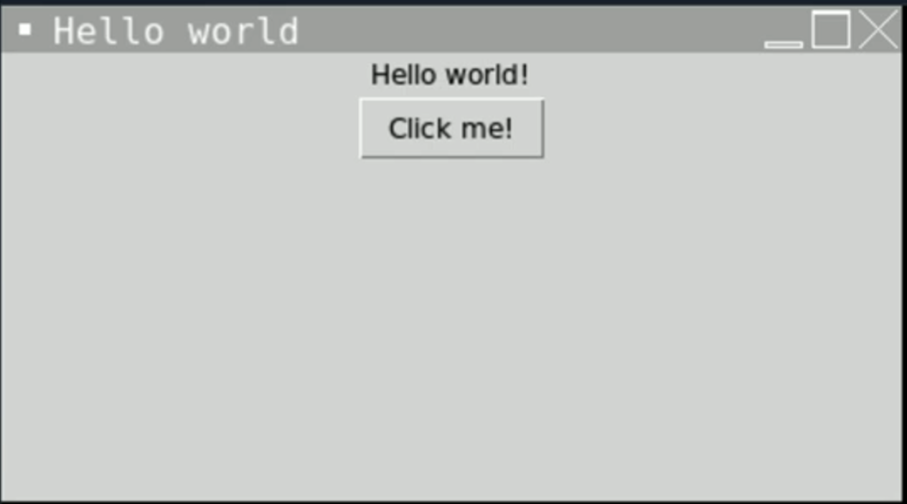

# Gooey GUIs

**DISCLAIMER: As the title states, this can get gooey. TKinter totally sucks - if you'd rather move on to something more fun, click "mark lesson as complete" and move on to Day 70 to get back to the good stuff.**

It's time to bring our programs into the early 90s as we learn how to create a Graphical User Interface (GUI) with a Python library called **tkinter**.


## tkinter

tkinter is one of the more popular Python GUI libraries.  

👉 When you start a tkinter project, you get some boilerplate, or starter code.

```Python
import tkinter as tk

window = tk.Tk()
window.title("Hello World") # Sets the name of the window in the border
window.geometry("300x300") # Sets the size of the window in pixels

hello = tk.Label(text = "Hello World") # Creates a text box
hello.pack() # 'pack' places the element on the screen

button = tk.Button(text = "Click me!") # Creates a button
button.pack()

tk.mainloop()
```
This code will produce a window that looks like this:



Play around with the size of the window to see the effect of changing the dimensions.

### Label Tricks

👉 We can also use variables to pass strings into labels like this:

```python
label = "Hey there world"
hello = tk.Label(text = label)

```

👉 Now I'm going to use  a subroutine that changes the text in the label when I click the button.


```python
window = tk.Tk()
window.title("Hello World") 
window.geometry("300x300") 

label = "Hey there world"

def updateLabel():
  label = "Bye world!"
  hello["text"] = label 
  # Subroutine that updates the text in the label.

hello = tk.Label(text = label) 
hello.pack() 

button = tk.Button(text = "Click me!", command = updateLabel) # Calls the updateLabel subroutine when the button is clicked
button.pack()

tk.mainloop()
```

👉 Let's try the same trick, only this time the label contains a number which increments with every button click.  For this I need to use a **global** label variable.

```python
window = tk.Tk()
window.title("Hello World") 
window.geometry("300x300") 

label = 0 # Sets the starting label value to 0

def updateLabel():
  global label # Uses the values in the label variable
  label += 1 # Adds one to the value in the label
  hello["text"] = label 
  

hello = tk.Label(text = label) 
hello.pack() 

button = tk.Button(text = "Click me!", command = updateLabel) # Calls the updateLabel subroutine when the button is clicked
button.pack()

tk.mainloop()
```


