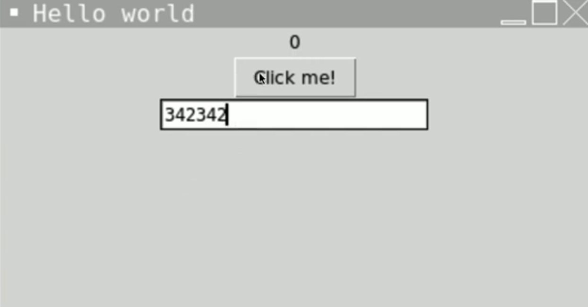

# Placing Items

Our window does look a bit odd, doesn't it?  Why have the button above the text box?



👉 We can simply change the order by defining the text box **before** the button in the code:

```python
window = tk.Tk()
window.title("Hello World") 
window.geometry("300x300") 

label = 0

 def updateLabel(): 
  global label
  number = text.get("1.0","end") 
  number = int(number) 
  label += number
  hello["text"] = label 
  

hello = tk.Label(text = label) 
hello.pack() 

text = tk.Text(window ,height=1, width = 50)
text.pack

button = tk.Button(text = "Click me!", command = updateLabel) 
button.pack()

tk.mainloop()
```


### Packing

We can add arguments to `pack()` to control the position of items in the window.  Again, I'm just showing the relevant lines of code in these examples.

👉 Let's move the button to the bottom of the window.

```python
button.pack(side=tk.BOTTOM)
```

👉 And the text box to the top to the left of the window.

```python
text.pack(side=tk.LEFT)
```
You can also use TOP, RIGHT, CENTER to control location.


## Unpacking 
If we had several buttons, the default would be to put them one on top of another.

```python
button = tk.Button(text = "Click me!",
command = updateLabel) 
button.pack()

button = tk.Button(text = "Another Button", command = updateLabel) 
button.pack()

button = tk.Button(text = "Last one", command = updateLabel) 
button.pack()

```


We can arrange them into a nicer grid layout, but to do this we have to **completely remove `pack`** and break the entire window into a grid.

👉 We then use row and column numbers (zero indexed remember) to place our elements.  I've put the label in row 0, text box in row 1 and buttons in row 2.

```python
window = tk.Tk()
window.title("Hello World") 
window.geometry("300x300") 

label = 0

def updateLabel():
  global label
  number = text.get("1.0","end") 
  number = int(number) 
  label += number
  hello["text"] = label 
  

hello = tk.Label(text = label).grid(row=0, column=1)


text = tk.Text(window ,height=1, width = 50).grid(row=1, column=1)


button = tk.Button(text = "Click me!", command = updateLabel).grid(row=2, column=0)

button = tk.Button(text = "Another Button", command = updateLabel).grid(row=2, column=1)

button = tk.Button(text = "Last one", command = updateLabel).grid(row=2, column=2)

tk.mainloop()
```

### Try It Out

