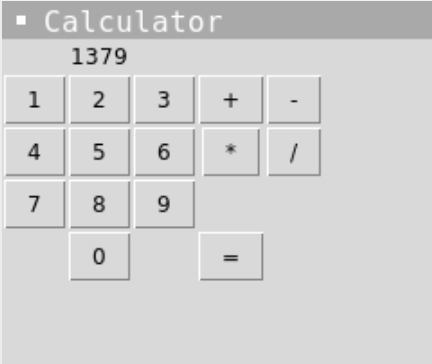

# 👉 Day 66 Challenge

Your challenge is to create a simple GUI calculator.

Your program should:

1. Have buttons for the numbers 0 to 9, plus, minus, multiply, divide and equals.
2. The user should be able to press buttons to create their calculation.
3. It should output the correct result when they press equals.

Example:

 
 💡 Hints 

  
- Use a grid to lay out the buttons.
- Create a buttonChoice subroutine or similar that takes in the value of the numeric button clicked, casts it to an int and displays it in the label.
- Create an operatorChoice sub that selects which operator to display and use.
- Investigate the `lambda` command for your buttons.
- Use a `calc` subroutine with global variables for answer, lastnumber and operator.

